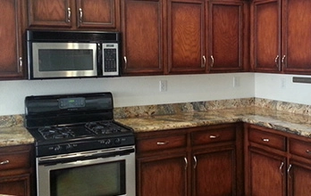

# Majestic Cabinets

[](https://developer.mozilla.org/en-US/docs/Web/HTML)
[](https://developer.mozilla.org/en-US/docs/Web/CSS)
[](https://developer.mozilla.org/en-US/docs/Learn/CSS/CSS_layout/Responsive_Design)
[](https://fontawesome.com/)
[](https://opensource.org/licenses/MIT)

## Contents

- [Pages](#pages)
  - [Home](#home)
  - [About](#about)
  - [Services](#services)
  - [Portfolio](#portfolio)
  - [Articles](#articles)
  - [Article Details](#article-details)
  - [Contact](#contact)
  - [Test Page](#test-page)
- [Shared Stylesheet and Assets](#shared-stylesheet-and-assets)
- [Key Features](#key-features)
- [Tech Stack](#tech-stack)
- [Tools Setup](#tools-setup)
  - [Code Editor](#code-editor)
  - [Git](#git)
  - [Browser and Developer Tools](#browser-and-developer-tools)
  - [External Font and Icon Tools](#external-font-and-icon-tools)
  - [Image Asset Workflow](#image-asset-workflow)
- [Getting Started](#getting-started)
- [Usage](#usage)
- [License](#license)
- [Back to Contact](#back-to-contact)

Majestic Cabinets is a responsive, multi-page brochure website for a Las Vegas cabinet company. It gives homeowners a clear way to explore cabinet services, review completed work, read renovation articles, and request a consultation or contact the business.

## Pages

| Page            | File                                           | Purpose                                                                           |
| --------------- | ---------------------------------------------- | --------------------------------------------------------------------------------- |
| Home            | [`index.html`](index.html)                     | Introduces the company, services, portfolio, blog previews, and consultation CTA. |
| About           | [`about.html`](about.html)                     | Explains the company, team, experience, and business functions.                   |
| Services        | [`services.html`](services.html)               | Presents refinishing, refacing, and custom-built cabinet services.                |
| Portfolio       | [`portfolio.html`](portfolio.html)             | Displays the cabinet project gallery and category controls.                       |
| Articles        | [`articles.html`](articles.html)               | Lists cabinet-related articles and categories.                                    |
| Article Details | [`articlesDetails.html`](articlesDetails.html) | Shows the cabinet-refacing article detail view.                                   |
| Contact         | [`contact.html`](contact.html)                 | Provides the consultation form, business details, and map embed.                  |
| Test Page       | [`test.html`](test.html)                       | Provides a standalone page for checking markup and styling changes.               |

### Home

[`index.html`](index.html) is the primary landing page. It combines the main promotion, company introduction, service highlights, portfolio preview, reasons to choose the company, recent article previews, email subscription form, and footer contact details.

```html
<h1>
  Refinish Your Cabinets <br />
  Save Up To 60%
</h1>
<p>Call us today for your FREE design consultation</p>
<a href="contact.html">Request a quote</a>
```

### About

[`about.html`](about.html) explains the company history, quality promise, design and innovation functions, team members, and contractor licensing information. It is intended for visitors who need more trust and company background before requesting a quote.

```html
<h1>About us</h1>
<p>HOME / ABOUT</p>
<h2>Welcome to <span>Majestic Cabinets</span></h2>
```

### Services

[`services.html`](services.html) presents the three core cabinet services: refinishing, refacing, and custom-built cabinetry. Each service uses an image from `images/` and a descriptive paragraph so visitors can compare the available options.

```html
<article class="service">
  
  <h4>Refinishing</h4>
  <p>Refresh existing cabinets without replacing the full kitchen.</p>
</article>
```

### Portfolio

[`portfolio.html`](portfolio.html) displays the project gallery with sixteen portfolio images and category labels for viewing all, cabinet, refinishing, and custom work. The current category controls are presentational links and do not filter the gallery.

```html
<div class="menu">
  <a class="active" href="#">view all</a>
  <a href="#">cabinets</a>
  <a href="#">refinish cabinets</a>
  <a href="#">custom</a>
</div>
```

### Articles

[`articles.html`](articles.html) is the article index. It contains cabinet-related posts, dates, authors, summaries, read-more controls, and a category list. The current article links and read-more buttons are placeholders until article routing is connected.

```html
<article class="article_list">
  <h3><a href="articlesDetails.html">Cabinet Refacing in Las Vegas</a></h3>
  <p class="post_time">Dec, 24th 2018 | Posted By <span>admin</span></p>
  <button type="button">Read More</button>
</article>
```

### Article Details

[`articlesDetails.html`](articlesDetails.html) provides the full cabinet-refacing article view. It includes the article metadata, two supporting images, detailed copy, and the same article category sidebar used on the index page.

```html
<p class="post_time">Dec, 24th 2018 | Posted By <span>admin</span></p>
<p class="post_article">
  Refacing the cabinets of your Las Vegas kitchen is easy with Majestic
  Cabinets!
</p>
```

### Contact

[`contact.html`](contact.html) is the conversion page. It contains the consultation form, physical address, phone and fax details, website information, and an embedded Google Map. The form is currently visual only and does not send or store submissions.

```html
<form action="/contact/" method="post">
  <input type="text" name="name" placeholder="Name" required />
  <input type="email" name="email" placeholder="Email" required />
  <textarea name="message" placeholder="Message" required></textarea>
  <input class="button" type="submit" value="Send Message" />
</form>
```

### Test Page

[`test.html`](test.html) is a standalone testing page. Use it to preview isolated HTML or CSS changes before applying them to the customer-facing pages. Keep experimental markup here clearly separated from production content.

```html
<!DOCTYPE html>
<html lang="en">
  <head>
    <meta charset="UTF-8" />
    <title>Majestic Cabinets Test Page</title>
    <link rel="stylesheet" href="style.css" />
  </head>
  <body>
    <main class="container">
      <h1>Component test</h1>
    </main>
  </body>
</html>
```

### Shared stylesheet and assets

[`style.css`](style.css) contains the shared layout and page-specific rules. Images are stored in [`images/`](images/) and referenced with relative paths from each HTML page.

```html
<link rel="stylesheet" href="style.css" />

```

## Key Features

- **Service discovery:** Highlights refinishing, refacing, custom cabinetry, design, and sales support.
- **Visual portfolio:** Uses project imagery from the `images/` directory to showcase completed cabinet work.
- **Editorial content:** Includes article listings, categories, and a detailed cabinet-refacing article.
- **Lead generation:** Provides consultation and email-subscription forms throughout the site.
- **Responsive presentation:** Uses shared CSS layouts designed for desktop and mobile viewports.
- **Business contact details:** Includes the Las Vegas address, phone numbers, email addresses, and an embedded Google Map.

## Tech Stack

- HTML5 for page structure and content
- CSS3 in [`style.css`](style.css) for layout, typography, responsive behavior, and visual styling

## Tools Setup

### Repository structure

The project is intentionally small and has no package manager or build directory. Keep page files at the repository root so their relative stylesheet, navigation, and image paths continue to work.

```text
Majestic-Cabinet/
├── index.html
├── about.html
├── services.html
├── portfolio.html
├── articles.html
├── articlesDetails.html
├── contact.html
├── test.html
├── style.css
├── images/
└── README.md
```

### Code editor

VS Code is recommended for editing HTML, CSS, and Markdown. Open the repository folder as a workspace so relative links and the `images/` directory are easy to inspect.

```bash
code Majestic-Cabinet
```

Useful extensions are optional: an HTML language-support extension, a CSS language-support extension, and a Markdown preview extension. The project does not require an extension to run.

To preview the README inside VS Code, open it and use the Markdown preview command:

```text
Ctrl+Shift+V
```

### Git

Git is used to download and version the project. Verify the installation before cloning:

```bash
git --version
git clone <repository-url>
cd Majestic-Cabinet
git status
```

### Browser and developer tools

Use Chrome, Edge, Firefox, or another modern browser to inspect the pages. Browser developer tools are useful for checking responsive breakpoints, missing images, invalid markup, and console errors.

```text
Open a page in the browser
Right-click -> Inspect
Check Console for errors
Check Network for 404 asset requests
Toggle device emulation for mobile layouts
```

After changing a page, check the browser at both a desktop and mobile width. Confirm that the shared header, images, footer, text, and links remain visible and usable.

### External font and icon tools

The pages load Google Fonts and Font Awesome from CDNs. An internet connection is required for those fonts and icons to appear. The HTML includes the Font Awesome stylesheet with an integrity value for safer loading.

```html
<link
  rel="stylesheet"
  href="https://cdnjs.cloudflare.com/ajax/libs/font-awesome/6.7.1/css/all.min.css"
/>
<i class="fa-solid fa-phone" aria-hidden="true"></i>
```

For an offline deployment, download and self-host approved font and icon assets, then replace the CDN links with local files.

### Image asset workflow

Keep image filenames stable because every page references them directly. Use WebP images where possible, provide meaningful `alt` text, and confirm every referenced file exists before deployment.

```text
images/
├── logo.webp
├── footer_logo.webp
├── portfolio1.webp ... portfolio16.webp
├── ourServices1.webp ... ourServices3.webp
└── articleDetails_img1.webp, articleDetails_img2.webp
```

When adding an image, update the HTML path and alternative text together:

```html

```

Before publishing, search for missing files and confirm that image names match their references exactly, including capitalization.

## Getting Started

### Prerequisites

- A modern web browser
- Optional: Git for cloning the repository

### Installation

Clone the repository and enter its directory:

```bash
git clone <repository-url>
cd Majestic-Cabinet
```

No package installation or build step is required for the current static implementation.

### Run locally

Open [`index.html`](index.html) in a modern browser. Use the navigation links to move between the static pages. A code editor extension with a live preview is optional, and no additional runtime server is required.

## Usage

### Browse the static site

```text
Home:           /index.html
About:          /about.html
Services:       /services.html
Portfolio:      /portfolio.html
Articles:       /articles.html
Article detail: /articlesDetails.html
Contact:        /contact.html
```

Use the primary pages to review services and project images. Use the Contact page to view business information, the map, and the consultation form. The current form is front-end markup only and does not process submissions.

### Contact link

Use this link from any static page to return visitors to the contact page:

```html
<a href="contact.html">Request a consultation</a>
```

## License

This project is released under the [MIT License](https://opensource.org/licenses/MIT). Add a `LICENSE` file containing the standard MIT License text before distributing the project in production.

## Back to Contact

[Return to the Contact page](contact.html) to view the consultation form, address, phone numbers, and map.
